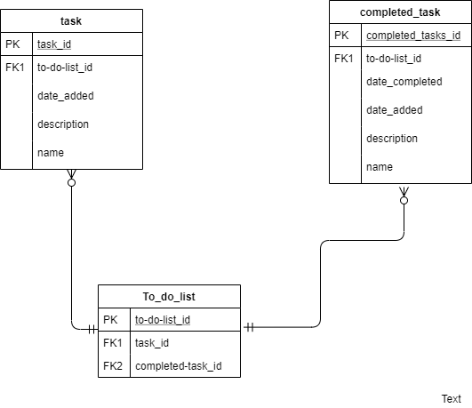

# Unit 7 Problem Set #3
## Schema Design and Building RESTful APIs

### Directions
1. Fork and clone this lab.
2. Answer the following questions directly in this README. Be sure that your answers are well-formatted. 
3. For the final question (build a to-do list), create all of your necessary app files in this directory. (I have included GitHub's standard Node.js `.gitignore` template so that you don't end up pushing `node_modules` to GitHub. 

## 

0. **What are the four types of HTTP requests that correspond to _creating_, _reading_, _updating_, and _deleting_ resources? Why is it important to use these different types of requests?**
<br>

The four http requests that correspond CRUD are these respectively. `POST`, `GET`, `PUT`, `DELETE`. It's important to use these requests so that you can create a stateful experience between your client side and server side. If your client creates a resource and that resource is not created and saved on the server side, the the application is essentially static, with the same assets and resources on each load. Saving, editing, or deleting corresponding data between client and server is integral to stateful applications.


1. **You've recently learned about an API for a cat sitting company. The API is fully RESTful for a resource called `cats`. You also happen to know that their database is running Postgresql on the backend. What are the five types of requests the API will respond to? Based on the description, list the HTTP method, the path, and what SQL the request will fire.**

| http method  |  path          | sql                                              | description              |
|--------------|----------------|--------------------------------------------------|--------------------------|
|  POST        |/add-cat        |INSERT INTO cats (cols.) VALUES (vals.)           | Creating a cat           |
|  GET         |/get-cats       |SELECT * FROM cats                                | Retrieving all the cats  |
|  GET         |/get-cat/:id    |SELECT * FROM cats WHERE id = $1                  | Retriving a specific cat |
|  PUT         |/edit-cat/:id   |UPDATE cats SET col = new val WHERE col = old val | Updating a specific cat  |
|  DELETE      |/delete-cat/:id |DELETE FROM cats Where col = val                  | Deleting a cat           |

<br>

2. **You're working on a blogging application and doing some debugging. You see in the logs that the following SQL has fired:**

   ```sql
   SELECT * FROM articles WHERE id = 9;
   ```

   **Given that the application is RESTful, what HTTP method and request would you expect to have been made to fire that SQL?**
<br>

The SQL query above is made to select all the properties of an article with an id of 9. Therefore the request that must have been made is a `GET` request with path of `/article/9`.


3. **You've been hired to do some work for Discogs, an application to help users track a vinyl record collection. A `Collection` has many `Albums`, and an `Album` has many collections via a join table called `Ownership`. You've been asked to build a feature that allows to remove an album from their collection. What HTTP Method/URL/controller action would you use to implement this feature?**
<br>

I would first build out the controller method which would contain my SQL query that deletes the album from the database.The mentioned SQL query would leverage the exitence of correlated Foreign keys on the Ownership table. The method I create would then be invoked upon the server recieving a `DELETE` request at the url `/delete-album/:id`. Or something in that realm. 


4. **Choose your favorite web application. What's an example of a one-to-many and many-to-many relationship that might exist within the app?**
<br>

One of my favorite apps is Instagram. I believe a great example of a one-to-many relationship would be the relationship between a post a tagged users. An example of a many-to-many relationship would be the relationship between users and mutual followers.

5. **Build a full CRUD, RESTful API using Express for a Todo List. A TodoList should have many items and belong to a user. Each endpoint should respond with the appropriate JSON response. Our API should support:**
   * **An index route to see a list of todos.**
   * **A show route to see details about an individual todo item.**
   * **The ability to update a todo (i.e. mark complete)**
   * **Delete a todo item**
   * **Create a Todo list item**

<center></center>

   **Deploy Your Project to Heroku and include a link here:**
